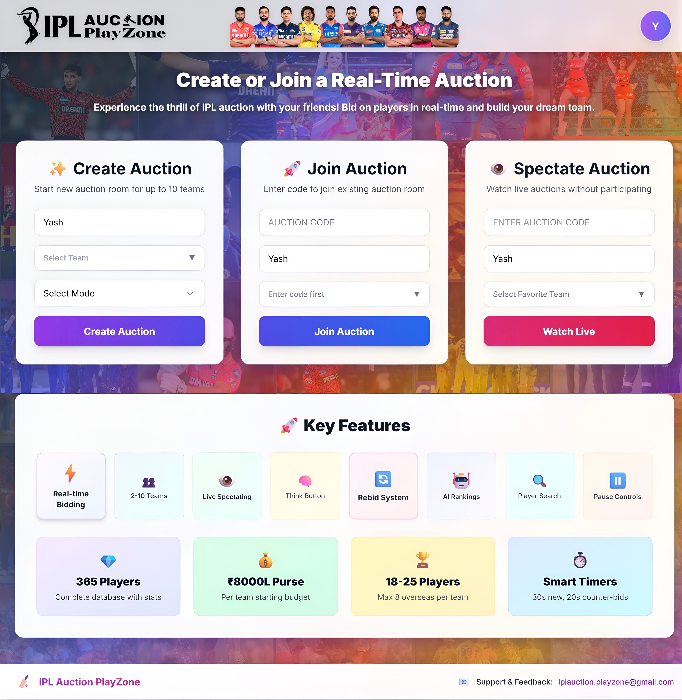

# 🎮 IPL Auction PlayZone - Features & Screenshots

## 📸 Visual Tour

### 🔐 Login Page

**Features:**
- Secure user authentication
- Clean and intuitive design
- Quick signup access
- Password recovery

---

### 🏠 Home Page

**Features:**
- Welcome dashboard
- Quick navigation
- Game overview
- Recent activity

---

### 🚪 Join Room

**Features:**
- Create custom auction rooms
- Join with room codes
- View active rooms
- Set room parameters
- Host controls

---

### 🏏 Live Auction Room

**Features:**
- Real-time bidding interface
- Live participant list
- Current bid display
- Countdown timer
- Budget tracker
- Player statistics
- Bid history
- Instant notifications

---

## ✨ Complete Feature List

### 🎯 Real-Time Auction System

- ⚡ Live bidding with instant updates
- 👥 Multiple players bid simultaneously
- ✅ Automatic bid validation and winner selection
- ⏱️ Countdown timer for each player auction
- 🔔 Real-time notifications
- 💬 Live chat functionality

### 🏠 Room Management

- 🆕 Create custom auction rooms
- 🔑 Join existing rooms with room codes
- 👑 Room host controls (start auction, manage settings)
- 👥 Player limit management
- 🎮 Spectator mode
- 📊 Room statistics

### 🏆 Team Building

- 💰 Budget allocation system
- 📋 Squad composition rules
- 🎯 Player role categorization:
  - 🏏 Batsman
  - ⚾ Bowler
  - 🌟 All-rounder
  - 🧤 Wicket-keeper
- 📈 Real-time team value tracking
- 📊 Team performance metrics

### 📚 Player Database

- 📊 Comprehensive IPL player statistics
- ⭐ Player ratings and base prices
- 🔍 Search and filter functionality
- 📝 Detailed player profiles
- 📈 Historical performance data
- 🏅 Player achievements

### 🎨 User Experience

- 📱 Intuitive and responsive UI
- 📲 Mobile-friendly design
- 🔔 Real-time notifications
- ✨ Smooth animations and transitions
- 🎨 Modern, cricket-themed interface
- 🏏 IPL team colors and branding
- 🎯 Clean and professional layout
- ♿ Accessibility-focused design

### 🔒 Security & Privacy

- 🔐 Secure authentication
- 🛡️ Protected room access
- ✅ Data validation
- 🔒 Safe multiplayer environment
- 🔑 Password encryption

### 📱 Platform Support

- 🌐 **Web Browsers**: Chrome, Firefox, Safari, Edge
- 💻 **Desktop**: Windows, macOS, Linux
- 📱 **Mobile**: iOS & Android
- 📲 **Tablets**: iPad, Android tablets
- 🌍 **Global Access**: Cloud-hosted

---

## 🎯 Key Highlights

✅ **Real-time Synchronization** - WebSocket-powered instant updates  
✅ **Multiplayer Ready** - Compete with friends globally  
✅ **Responsive Design** - Seamless experience on all devices  
✅ **Professional UI** - IPL-themed modern interface  
✅ **Smooth Performance** - Optimized for speed  
✅ **Easy to Use** - Intuitive navigation and controls  

---

## 💡 Why IPL Auction PlayZone?

- 🏏 **For Cricket Fans**: Experience the thrill of IPL auctions
- 🎮 **For Gamers**: Strategic gameplay with real-time competition
- 👨‍💻 **For Developers**: Learn from real-time multiplayer architecture
- 🤝 **For Communities**: Perfect for group entertainment

---

## 📧 Feedback & Suggestions

Love what you see? Have ideas for improvements?

📧 **Email**: iplauction.playzone@gmail.com

**Let's Connect!** Whether you're a cricket fan, a tech enthusiast, or a developer who loves real-time systems — let's collaborate and build something epic! 🏆

---

[← Back to Main Page](README.md)
